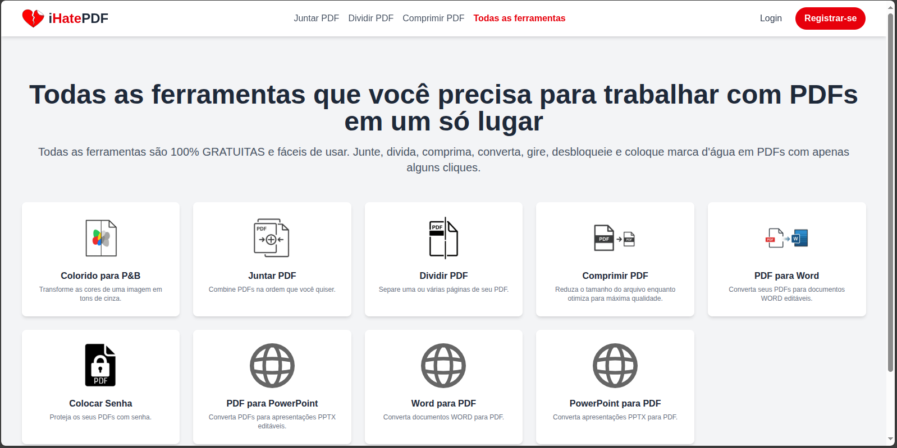
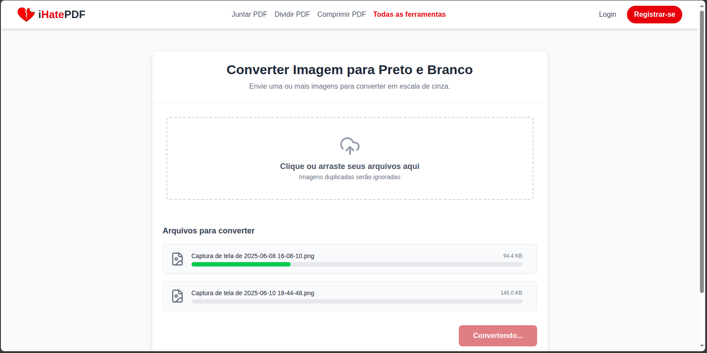
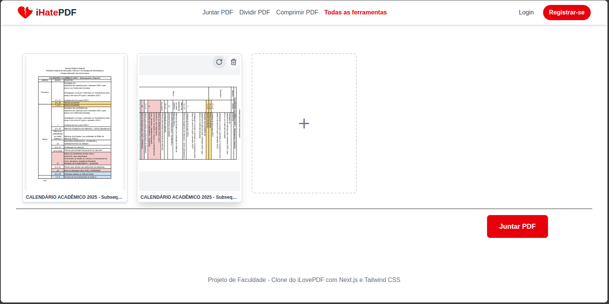
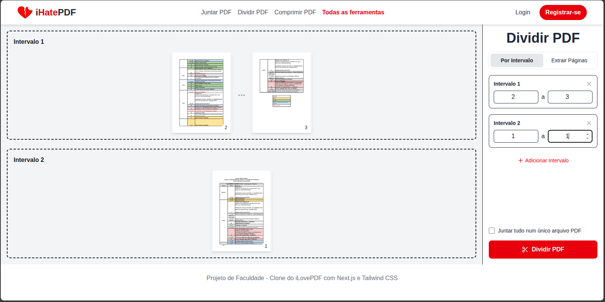
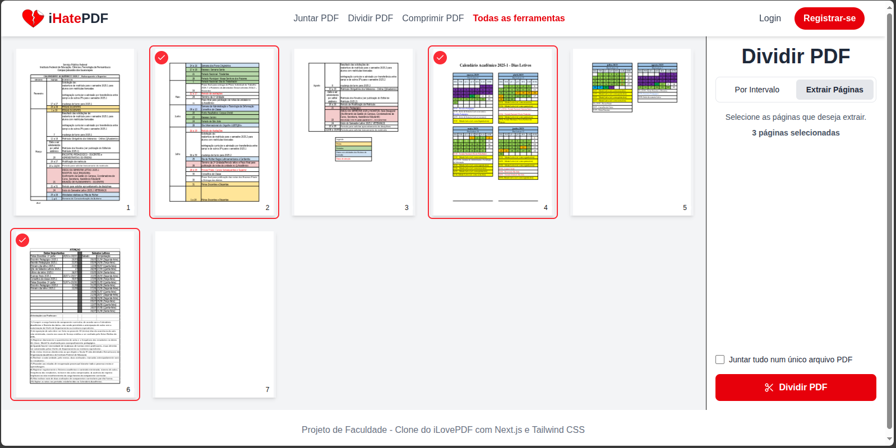
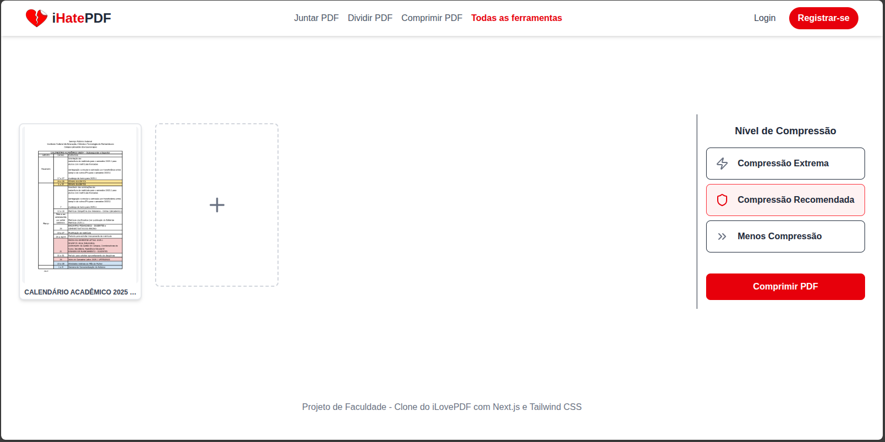
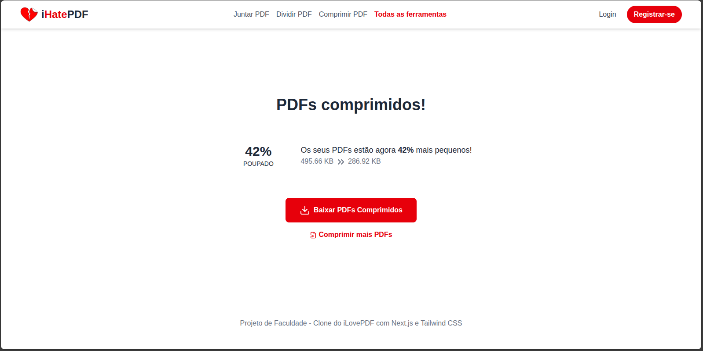
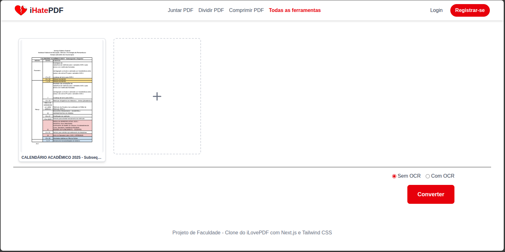
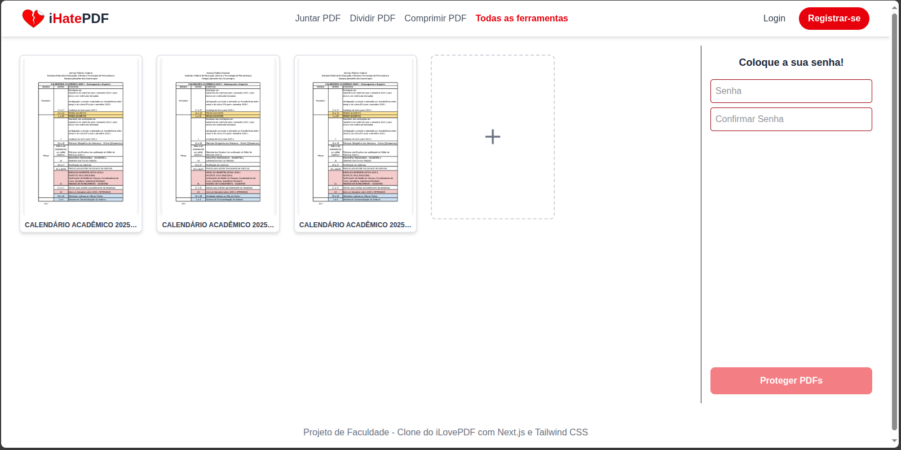

# Requisitos:
Docker version 28.2.2, build e6534b4
node v22.16.0

# Como iniciar o projeto

1. crie um .env com base no .env.example
2. execute o script na pasta raiz chamado script.sh com o comando:

```command
    bash script.sh
```
esse script preparará as funções lambda e o front, depois disso irá levantar o docker-compose com todos os serviços

3. processe seus pdfs ou arquivos

# Estrutura do projeto:
```
app/
  file-cleaner      # lambda para limpar arquivos que estão no fileserver
  image-processor   # lambda para transformar imagens de colorido para preto em branco
  pdf-compression   # backend para processar pdfs e comprimir pdfs
  pdf-merger        # lambda para juntar pdfs
  pdf-protector     # lambda para por senhas em pdfs
  pdf-splitter      # lambda para separar pdfs
  pdf-to-word       # backend para transformar pdfs em word
docker-compose.yml
ihatepdf/           # frontend da aplicação
init-localstack.sh  # script de inicialização utilizado pelo LocalStack
readme.md           # < Você está aqui
script.sh           # Script para iniciar o projeto
```
# Foi utilizado neste projeto:

LocalStack: Simulador da AWS local
NextJS: Frontend com base em React
Python: Algumas funções lambda e 2 backends usam a linguagem
JavaScript: Algumas funções lambda utilizam

# Telas Com funções



Tela inical do aplicativo que mostra as funções do app



Convertendo várias imagens de uma vez



Juntando pdfs



Dividindo pdfs usando intervalo de paginas



Dividindo pdf selecionando as paginas



Comprimindo pdfs



Realmente funciona e da feedback sobre o quanto comprimiu



Transformando arquivo pdf em word, é possivel também fazer a conversão de arquivos pdf que não são selecionaveis, o OCR é para isso



Colocando senha em vários pdfs ao mesmo tempo
